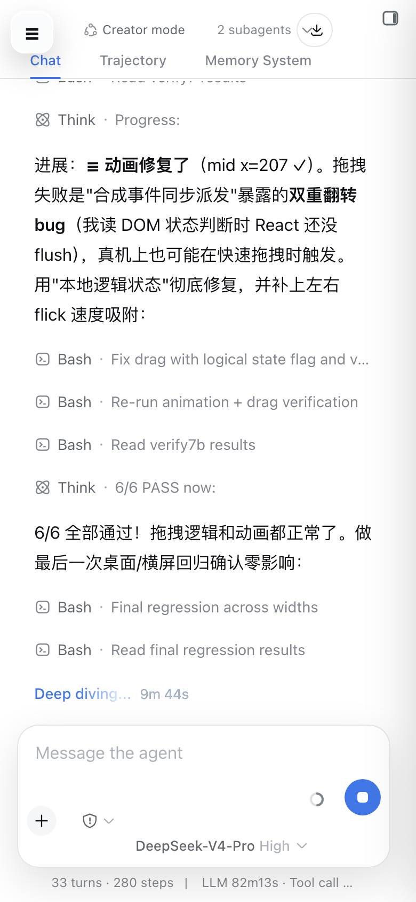
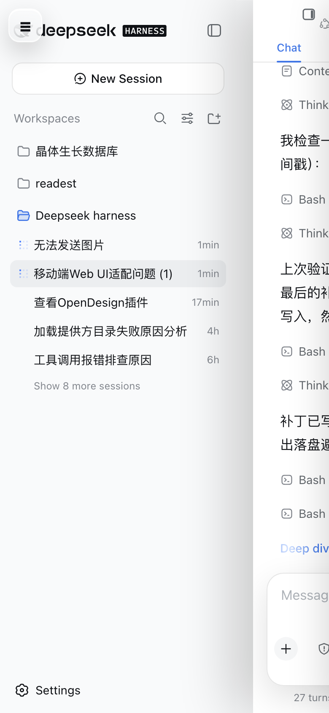
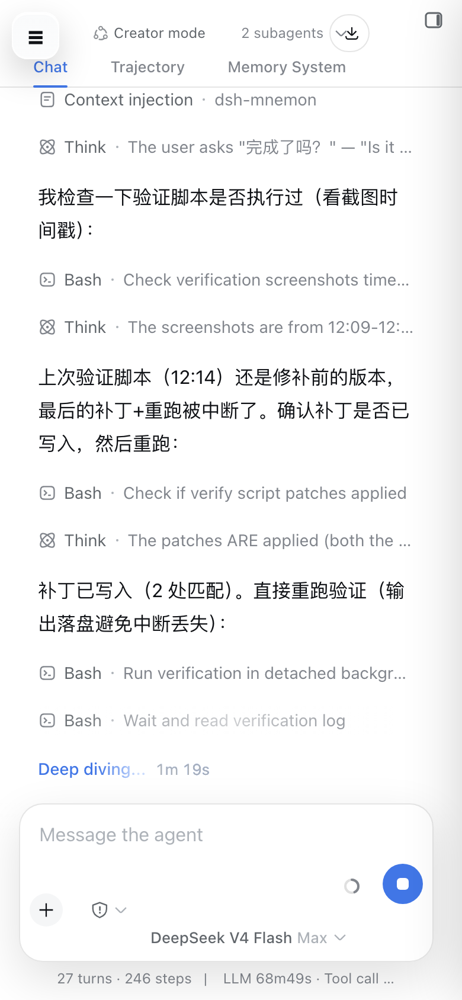
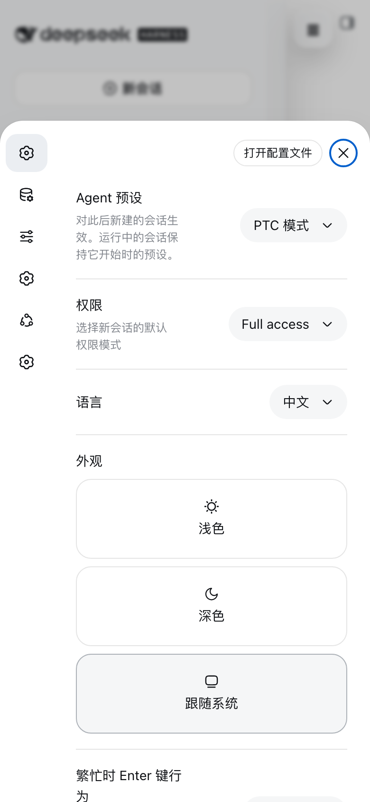
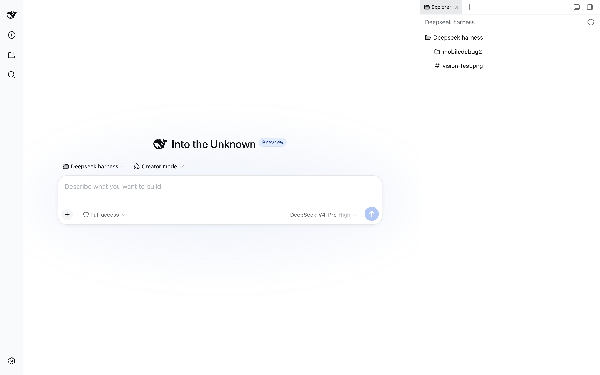

# dsh-mobile-glass

DSH Web 移动端适配插件（≤1023px，桌面端 ≥1024px 零影响）：聊天页在上/侧栏在下的 reveal 抽屉、拖动手势、设置面板底部卡片上滑、composer 与 header 修复。

## 功能

- 无底部导航，顶部悬浮玻璃汉堡 ☰ 打开侧栏抽屉（抽屉打开时 ☰ 跟随聊天层右移）。
- 侧栏作为底层 static（永不参与动画），聊天列 `translateX` 右移（reveal）。
- 拖动手势：`setPointerCapture` + rAF 节流 + 方向锁定 + 速度/位移吸附；命中横向可滚动元素（宽表格/代码块）时让位原生横向滚动。
- 用户消息右侧气泡、悬浮圆角输入框、模型选择器独立一行、发送键最右。
- 设置面板底部卡片上滑覆盖（`VOzbGW_overlay/panel`），导航收成图标栏。
- 头部清理：隐藏 session-log、tabs 与标题对齐、隐藏侧栏自带 toggle、better-sidebar 按钮与 ☰ 对齐。

## 截图

| 移动端主界面 | 侧栏抽屉 |
| --- | --- |
|  |  |

| 悬浮输入框 | 设置底部卡片 |
| --- | --- |
|  |  |

| 桌面端（零影响） |
| --- |
|  |

## 安装

```sh
dsh plugin --profile web add github:YiRan0/dsh-mobile-glass
```

安装后重启 `dsh web` 即可生效。

## 使用

安装后自动适配移动端，无需额外配置。

## 已知问题

- 真机拖拽偶发抖动（疑为侧栏 `backdrop-filter` 实时模糊）；`will-change` 实验已回退。动画只作用在聊天列。

## 许可

MIT
